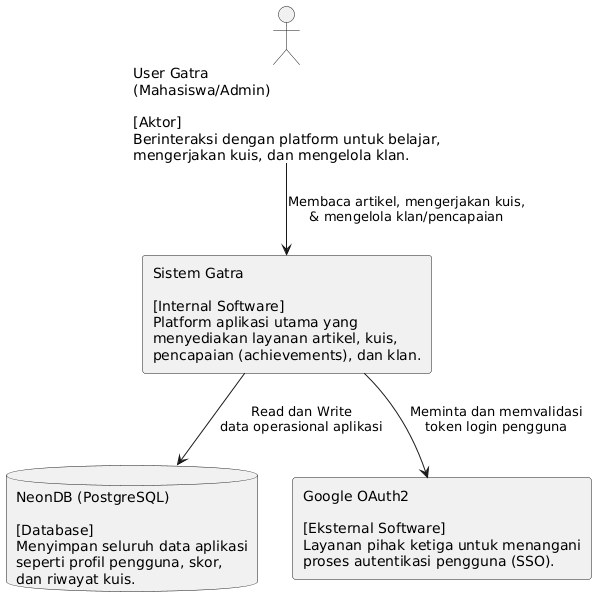
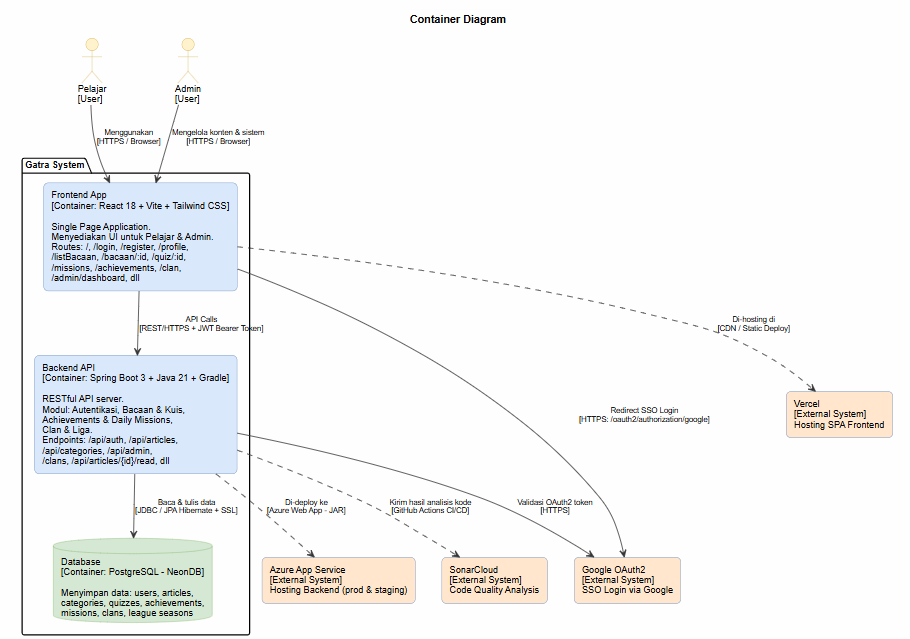
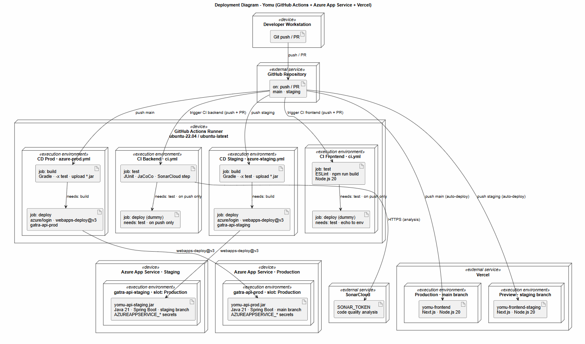
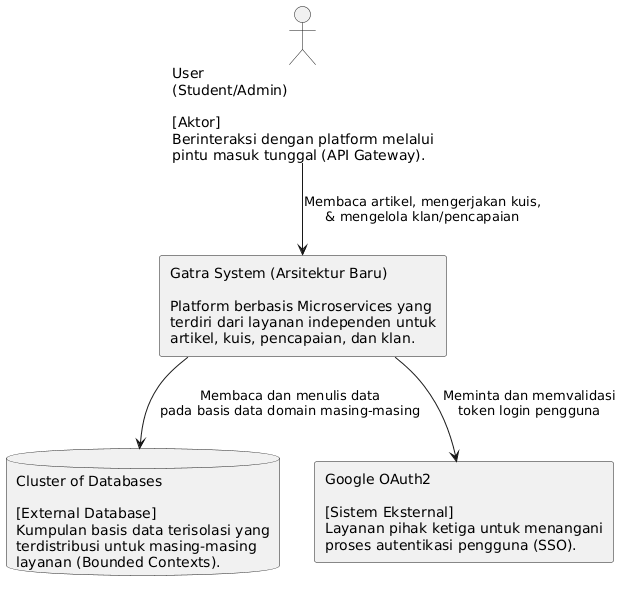
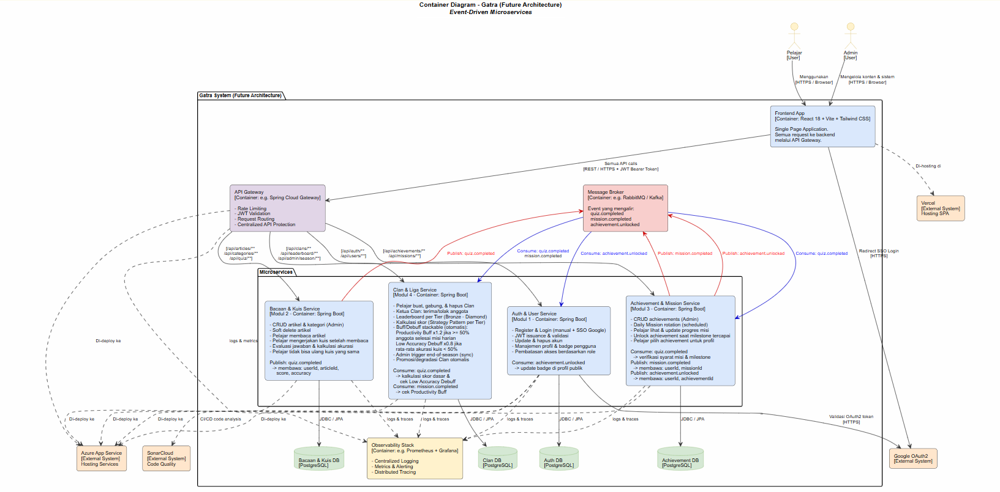

## Current Architecture

---
### Context Diagram

### Container Diagram

### Deployment Diagram

## Future Architechture

---
### Context Diagram

### Container Diagram

## Analisis Risiko

---
Risiko arsitektur yang paling mendasar terletak pada struktur backend yang saat ini masih berupa monolith tunggal. Semua fitur mulai dari artikel, kuis, misi, sistem clan, hingga operasional admin, berjalan dalam satu proses aplikasi dan menggunakan basis data yang sama. Model ini mempermudah proses pengembangan di awal, tetapi terdapat titik lemah yang cukup kritikal, yaitu beban berat atau kegagalan pada satu fitur dapat mengganggu fungsionalitas lain yang sebenarnya tidak terkait. Sebagai contoh, proses klaim hadiah misi dan skoring clan yang berada dalam satu jalur permintaan atau request path membuat alur pengalaman pengguna menjadi rentan. Jika skoring bermasalah, seluruh progres misi bisa dianggap tidak andal oleh pengguna.

Dari sisi operasional, sistem saat ini masih bergantung pada environment secrets dan URL layanan yang bersifat dasar. Belum terdapat skema observabilitas yang baik, seperti centralized logging, rate limiting, atau prosedur backup atau restore. Karena frontend berinteraksi langsung dengan backend, setiap API publik harus diproteksi secara manual melalui Spring Security. Seiring bertambahnya fitur, pengelolaan jalur endpoint dan aturan otorisasi yang tidak konsisten berisiko menjadi beban maintenance sekaligus celah keamanan.

Untuk memitigasi celah tersebut, arsitektur masa depan perlu diubah menjadi event-driven microservices. Daripada menumpuk seluruh logika bisnis dalam satu tempat, sistem akan dipecah menjadi domain service yang spesifik, seperti service autentikasi, kuis, achievement, serta clan atau skoring. Service ini hanya akan berkomunikasi secara sinkron jika memerlukan respons instan, sementara efek samping antarmodul akan dikelola melalui mekanisme event.

## Justifikasi Modifikasi Arsitektur

---
Perubahan arsitektur menjadi event-driven microservices didasari oleh kebutuhan aplikasi untuk menangani berbagai domain dengan karakteristik beban yang berbeda. Proses seperti pengerjaan kuis, pembaruan misi, hingga skoring leaderboard tidak harus selalu diselesaikan dalam satu siklus permintaan yang sinkron. Dengan menerapkan sistem event setelah pengguna melakukan aksi penting, setiap layanan dapat menjalankan fungsinya masing-masing secara independen. Hasilnya, frontend bisa memberikan respons yang lebih cepat dan stabil kepada pengguna.

API gateway akan menjadi gerbang yang memperketat keamanan API publik melalui sentralisasi autentikasi, rate limiting, kebijakan CORS, serta pencatatan log. Sementara itu, penggunaan message broker akan meminimalkan ketergantungan antar-layanan. Misalnya, ketika seorang siswa menyelesaikan kuis, service kuis cukup mengirimkan sinyal `QuizCompleted`. Service achievement dan scoring kemudian akan menangkap sinyal tersebut untuk memperbarui data secara mandiri. Jika salah satu layanan sedang sibuk atau tidak tersedia, sistem dapat melakukan percobaan ulang tanpa menyebabkan proses kuis pengguna gagal. Jika service scoring sedang down, data kuis tidak hilang. Pesan tetap tersimpan di dalam queue pada broker, dan akan diproses secara otomatis saat layanan kembali pulih.

Penerapan arsitektur ini meningkatkan skalabilitas dan memperjelas pembagian tanggung jawab modul. Namun, terdapat drawback seperti memastikan konsistensi data, mencegah duplikasi event, serta menjamin bahwa setiap layanan bersifat idempoten. Selain itu, perlu juga untuk menangani prosedur deployment yang jauh lebih rumit.