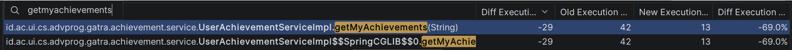
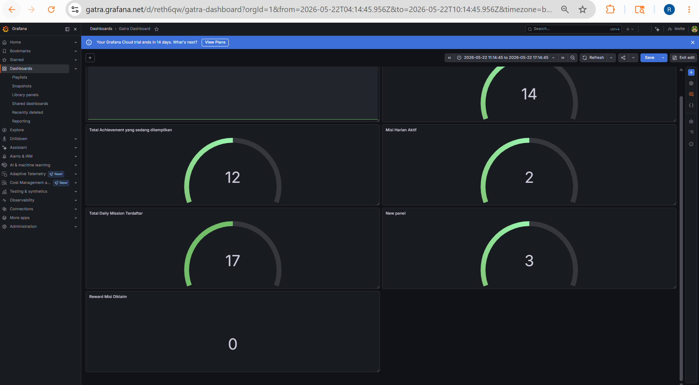

### Justifikasi Profiling
Profiling dilakukan pada method getMyAchievements karena endpoint `/api/achievements/me` mengambil daftar achievement milik user, lalu setiap `UserAchievement` dipetakan menjadi `AchievementResponse`. Pada proses mapping, kode mengakses `userAchievement.getAchievement()` untuk membaca detail achievement seperti `name`, `category`, `description`, dan `badgeUrl`.

Sebelum improvement, relasi pada UserAchievement didefinisikan sebagai:
```java
@ManyToOne(fetch = FetchType.LAZY)
private Achievement achievement;
```
Karena relasi bersifat LAZY, query awal findByUserId(userId) hanya mengambil data dari tabel user_achievements. Setelah itu, saat mapper mengakses getAchievement(), Hibernate perlu menjalankan query tambahan untuk mengambil data achievement. Jika user memiliki N achievement, maka jumlah query dapat menjadi N+1.

### Improvement yang dilakukan

Saya menambahkan JOIN FETCH pada repository:
```java
@Query("SELECT ua FROM UserAchievement ua JOIN FETCH ua.achievement WHERE ua.userId = :userId")
List<UserAchievement> findByUserId(UUID userId);

@Query("SELECT ua FROM UserAchievement ua JOIN FETCH ua.achievement WHERE ua.userId = :userId AND ua.isDisplayed = true")
List<UserAchievement> findByUserIdAndIsDisplayedTrue(UUID userId);
```

Dengan JOIN FETCH, Hibernate mengambil UserAchievement dan Achievement dalam satu query menggunakan join. Jadi ketika mapper mengakses userAchievement.getAchievement(), data achievement sudah tersedia dan tidak memicu query tambahan.

### Hasil Profiling


### Justifikasi Desain Monitoring


Pada AchievementMetricsService, didaftarkan 6 custom metrics menggunakan Gauge. Gauge dipilih karena metrik yang dipantau adalah nilai absolut yang merepresentasikan "keadaan saat ini" (state) dari database, bukan sebuah event yang terus bertambah tanpa batas (seperti counter) atau durasi eksekusi (seperti timer).

Metrik yang dipantau:
gatra.achievement.total: Total tipe achievement yang ada di sistem.
gatra.achievement.displayed.total: Total achievement yang di-pin/ditampilkan di profil user.
gatra.mission.total: Total template daily mission yang ada.
gatra.mission.active: Jumlah misi harian yang sedang aktif (normalnya 3).
gatra.mission.progress.total: Total entri progres misi yang sedang atau sudah dikerjakan user.
gatra.mission.progress.claimed: Total reward misi yang sudah diklaim.

Metrik-metrik ini sangat krusial tidak hanya untuk tim engineering, tetapi juga untuk tim product/business. Dengan melihat jumlah agregat ini, kita bisa mengetahui tingkat engagement user terhadap fitur achievement & daily mission secara real-time.