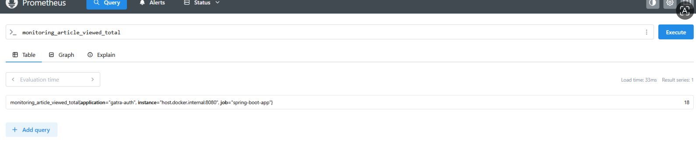
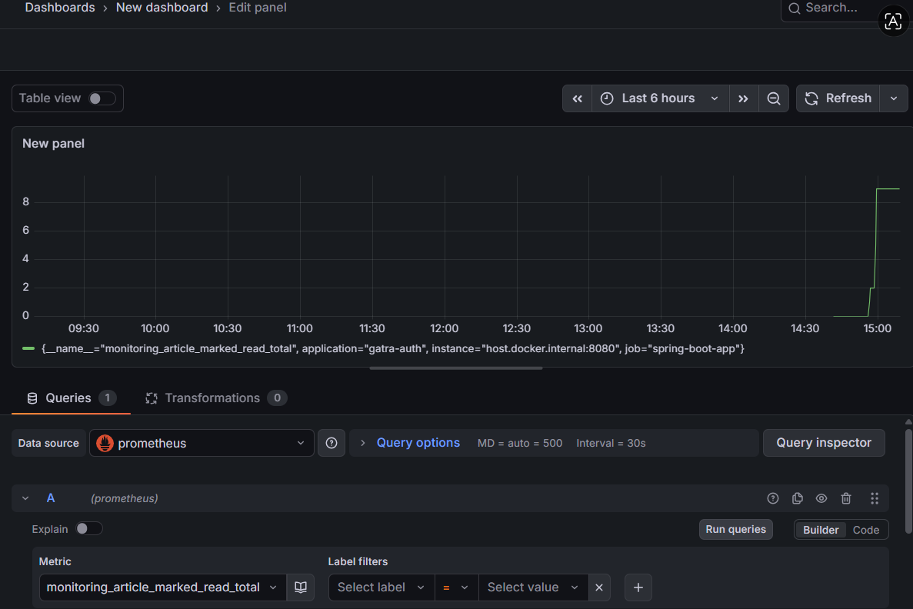
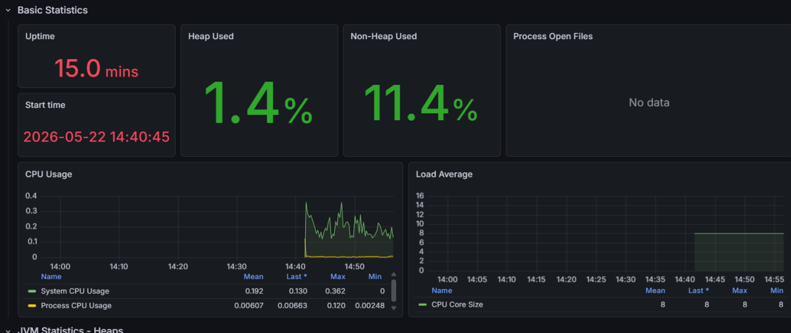
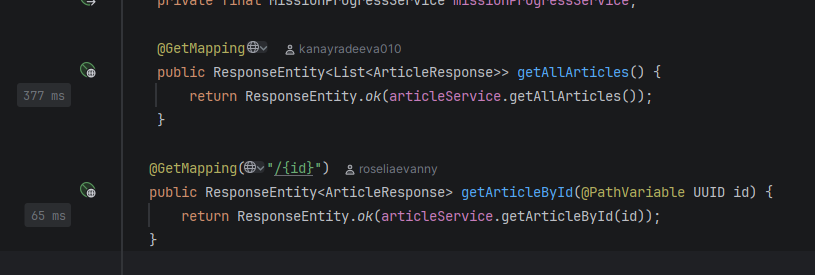
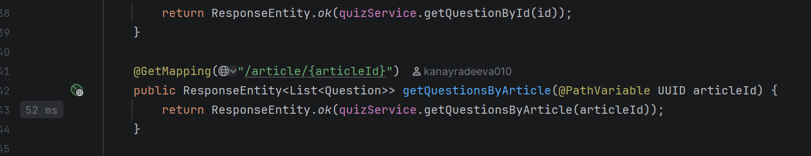
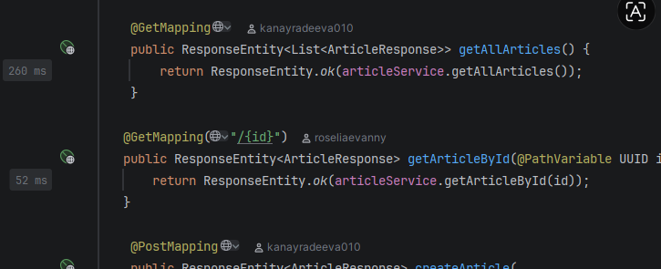
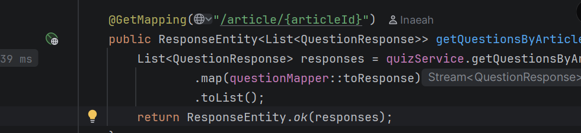
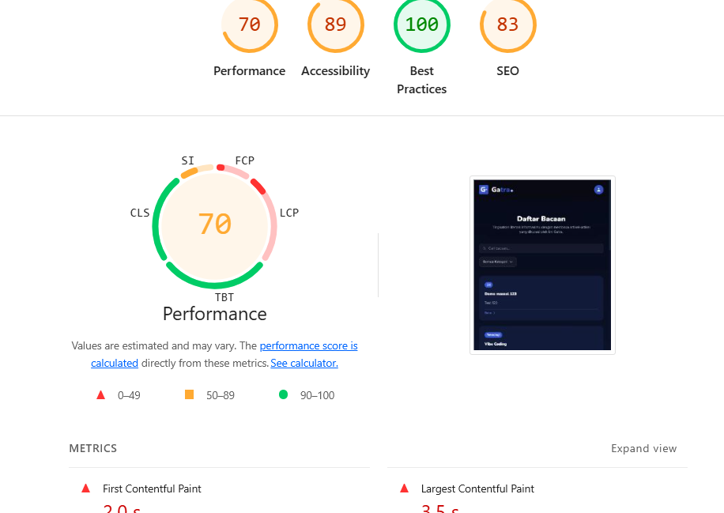
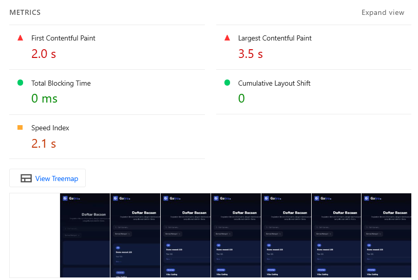

## Monitoring

### Justifikasi Desain Monitoring

Implementasi monitoring pada modul bacaan dan kuis dilakukan menggunakan Spring Boot Actuator, Micrometer, Prometheus, dan Grafana. Spring Boot Actuator digunakan untuk mengekspos endpoint observability seperti `/actuator/health`, `/actuator/metrics`, dan `/actuator/prometheus`. Endpoint `/actuator/prometheus` digunakan oleh Prometheus untuk melakukan scraping metric dari aplikasi. 
Micrometer digunakan untuk menambahkan custom business metric yang relevan dengan fitur yang saya kerjakan. Pada modul bacaan, metric yang ditambahkan adalah `monitoring_article_total`, `monitoring_article_viewed_total`, `monitoring_article_marked_read_total`, dan `monitoring_article_deleted_total`. Metric tersebut digunakan untuk memantau jumlah artikel yang dibuat, dibuka, ditandai sudah dibaca, dan dihapus.
Pada modul kuis, metric yang digunakan adalah `monitoring_question_total`, `monitoring_question_updated_total`, `monitoring_question_deleted_total`, `monitoring_passing_score_updated_total`, `monitoring_quiz_submitted_total`, `monitoring_quiz_passed_total`, dan `monitoring_quiz_failed_total`. Metric tersebut digunakan untuk memantau aktivitas pembuatan soal, perubahan soal, penghapusan soal, perubahan passing score, jumlah submit kuis, serta hasil kuis lulus atau gagal.
Desain ini dipilih karena monitoring tidak hanya mencakup aspek teknis aplikasi seperti uptime, CPU usage, memory usage, response time, dan jumlah HTTP request, tetapi juga mencakup aktivitas bisnis utama pada modul bacaan dan kuis. Dengan adanya custom metric, kita dapat mengetahui apakah fitur utama digunakan dengan normal, mendeteksi peningkatan aktivitas pengguna, serta melihat potensi masalah seperti banyaknya quiz yang gagal atau endpoint yang lambat.

### Contoh Penggunaan
Monitoring digunakan dengan menjalankan aplikasi Spring Boot, Prometheus, dan Grafana. Setelah aplikasi berjalan, endpoint pada modul bacaan dan kuis diakses untuk menghasilkan metric, misalnya:

- `POST /api/articles`
- `GET /api/articles/{id}`
- `POST /api/articles/{id}/read`

Setelah endpoint tersebut diakses, Prometheus digunakan untuk mengecek metric custom. Contoh hasil monitoring yang berhasil diperoleh adalah:

Metric tersebut membuktikan bahwa aktivitas pada modul bacaan dan kuis berhasil tercatat. Selain itu, Grafana digunakan untuk memvisualisasikan metric dalam bentuk dashboard yang lebih mudah dibaca.

## Profiling

### Before

### After

Proses profiling dilakukan menggunakan IntelliJ Profiler dengan metode CPU Time sampling pada dua sesi, yaitu before refactor dan after refactor dengan hit endpoint yang sama.
getAllArticles turun dari 377ms 260ms (-31%) karena refactor menghilangkan overhead serialisasi entity JPA secara langsung. Setelah refactor, data dikonversi via ArticleMapper ke DTO sebelum dikembalikan, sehingga Hibernate tidak perlu lazy-load relasi yang tidak dibutuhkan.
getQuestionsByArticle turun dari 52ms ke 39ms (-25%) karena penambahan QuestionMapper yang mengkonversi ke QuestionResponse DTO, Jackson tidak perlu serialize seluruh entity Question beserta relasinya ke Article.
getArticleById turun dari 65ms ke 52ms (-20%) karena penambahan guard isDeleted() yang fail-fast sebelum mapping, menghindari pemrosesan yang tidak perlu.

## Performance testing Lighthouse

Performance testing dilakukan menggunakan Lighthouse pada Chrome DevTools untuk mengevaluasi performa frontend pada halaman daftar bacaan. Pengujian ini dilakukan untuk melihat pengalaman pengguna dari sisi browser, terutama terkait kecepatan halaman dalam menampilkan konten.
Berdasarkan hasil Lighthouse, halaman daftar bacaan memperoleh skor Performance sebesar 70. Nilai First Contentful Paint (FCP) adalah 2.0 detik dan Largest Contentful Paint (LCP) adalah 3.5 detik. Hal ini menunjukkan bahwa konten awal dan konten utama halaman masih membutuhkan waktu cukup lama untuk tampil. Namun, nilai Total Blocking Time (TBT) sebesar 0 ms dan Cumulative Layout Shift (CLS) sebesar 0 menunjukkan bahwa halaman tidak mengalami blocking JavaScript dan tidak terjadi pergeseran layout saat proses loading.
Dari hasil tersebut, bottleneck utama terdapat pada proses loading awal halaman, terutama ketika daftar bacaan dimuat dan dirender. Oleh karena itu, improvement yang dapat dilakukan adalah menambahkan loading skeleton, mengoptimalkan request data bacaan, menerapkan pagination untuk daftar artikel, serta memastikan asset frontend tidak terlalu besar.
Secara keseluruhan, hasil performance testing menunjukkan bahwa halaman sudah cukup stabil dari sisi interaksi dan layout, tetapi masih dapat ditingkatkan pada aspek kecepatan pemuatan konten awal.