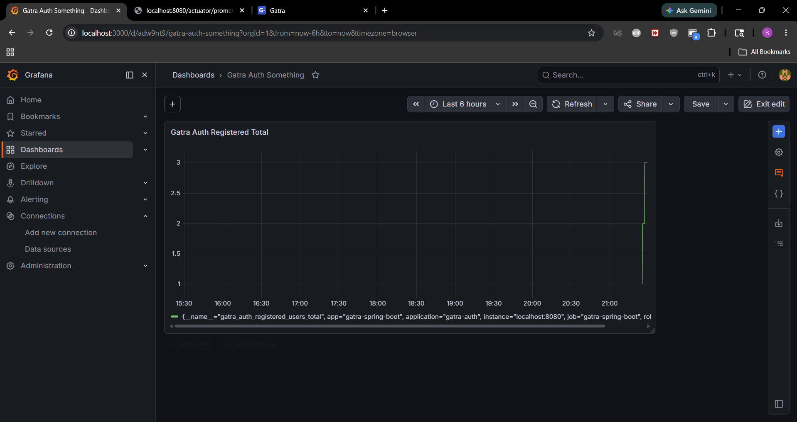

## Profiling getUsers

Before: 7.1 s

After: 1.14 s

### Catatan Optimasi: Perbaikan N+1 Query pada `UserService.getAllUsers()`

**Konteks Masalah (The N+1 Query Problem):**
Sebelum optimasi, method `getAllUsers()` mengambil seluruh entitas `User` (1 query utama). Namun, saat melakukan *mapping* data ke dalam bentuk `UserResponse`, sistem menjalankan dua query tambahan untuk setiap iterasi user individu:
1. `studentProfileRepository.findById(user.getId())`
2. `pointHistoryRepository.sumPointsByUserId(user.getId().toString())`

Ini berarti jika terdapat 1.000 user, sistem akan mengeksekusi **2.001 query SQL** (1 + 1000 + 1000). Kondisi ini menyebabkan beban database (*database overhead*) yang eksponensial seiring bertambahnya jumlah user.

**Pendekatan Solusi (Batch Fetching & In-Memory Stitching):**
Untuk memutus siklus pemanggilan database di dalam *looping*,mengimplementasikan pola pengambilan data secara *batch*:
1. Mengumpulkan semua `UUID` dari entitas `User` yang diambil pada query pertama.
2. Mengeksekusi dua *batch query* menggunakan klausa `IN` untuk mengambil seluruh `StudentProfile` dan total skor `PointHistory` dari semua user terkait sekaligus.
3. Mengonversi hasil data mentah (*batch result*) menjadi struktur data `Map` di Java (Memory).
4. Menyusun `UserResponse` dengan melakukan pencarian (*lookup*) ke dalam `Map` tersebut (O(1) *time complexity*), sehingga *mapping* berjalan sangat cepat tanpa interaksi database tambahan.

**Hasil Perbandingan (Profiling):**
- **Sebelum:** O(N) Query — Jumlah eksekusi query bergantung pada jumlah pengguna (contoh: puluhan hingga ribuan query).
- **Sesudah:** O(1) Relatif — Kompleksitas query konstan menjadi tepat **3 query SQL** untuk *request* sebesar apapun.

## Monitoring

### Justifikasi Desain & Implementasi Monitoring

Implementasi sistem monitoring pada modul `auth/user` di aplikasi Gatra dirancang untuk mencapai tingkat **Observabilitas (Observability)** yang komprehensif. Arsitektur pemantauan ini dibangun menggunakan **Spring Boot Actuator** dan **Micrometer Prometheus**, yang kemudian diintegrasikan dengan **Prometheus Server** dan **Grafana** untuk visualisasi antarmuka grafis (GUI).

#### 1. Keamanan Akses Data Internal (Strategi Port Separation)
Mengacu pada *best practice* keamanan DevOps, data observabilitas internal tidak boleh terekspos secara bebas ke jaringan internet publik. Oleh karena itu, arsitektur dikonfigurasi secara berlapis:
* **Environment Development (Local):** Endpoint `/actuator/health` dan `/actuator/prometheus` dibuka pada port utama (`8080`) untuk mempermudah tim melakukan *debugging* lokal.
* **Environment Production (Azure App Service / VM):** Pada berkas `application-prod.properties`, diterapkan strategi **Port Separation** melalui konfigurasi `management.server.port=8081`. Aplikasi utama melayani pengguna publik di port 80/8080, sementara port metrik (8081) diisolasi oleh *firewall* / Network Security Group (NSG) bawaan Azure. Hal ini mencegah eksploitasi data oleh pihak luar, sementara metrik tetap aman untuk di-*scrape* oleh sistem internal.

#### 2. Implementasi Custom Business Metric
Selain memantau infrastruktur standar (*CPU usage, JVM memory, database connection pool*), sistem ini menginjeksi metrik bisnis spesifik menggunakan komponen *Counter* dari Micrometer, yaitu `gatra.auth.registered.users` pada kelas `AuthServiceImpl`.
* **Justifikasi:** Modul autentikasi adalah gerbang utama aplikasi. Dengan memantau metrik pendaftaran akun secara dinamis, tim pengembang tidak hanya mendapatkan analitik performa bisnis, tetapi juga dapat memprediksi lonjakan trafik untuk melakukan penyesuaian skala (*scaling*) infrastruktur secara proaktif.

#### 3. Visualisasi dan Pemantauan Real-Time (GUI)
Agar metrik yang terekspos dapat dibaca dan dianalisis oleh manusia dengan mudah, alur monitoring dilanjutkan ke tahap visualisasi menggunakan standar industri pemantauan modern:
1. **Scraping (Prometheus):** Server Prometheus dikonfigurasi secara mandiri untuk secara berkala (*polling*) mengambil data mentah dari *endpoint* `localhost:8081/actuator/prometheus` milik aplikasi Gatra.
2. **Dashboarding (Grafana):** Grafana dihubungkan ke *database* Prometheus sebagai *Data Source*. Metrik `gatra_auth_registered_users_total` divisualisasikan ke dalam bentuk grafik *Time-Series* (GUI) yang interaktif.
