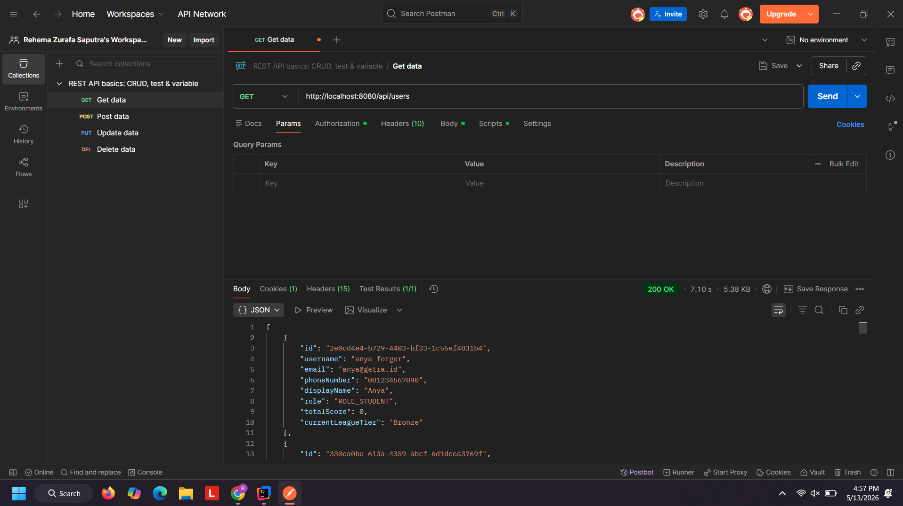
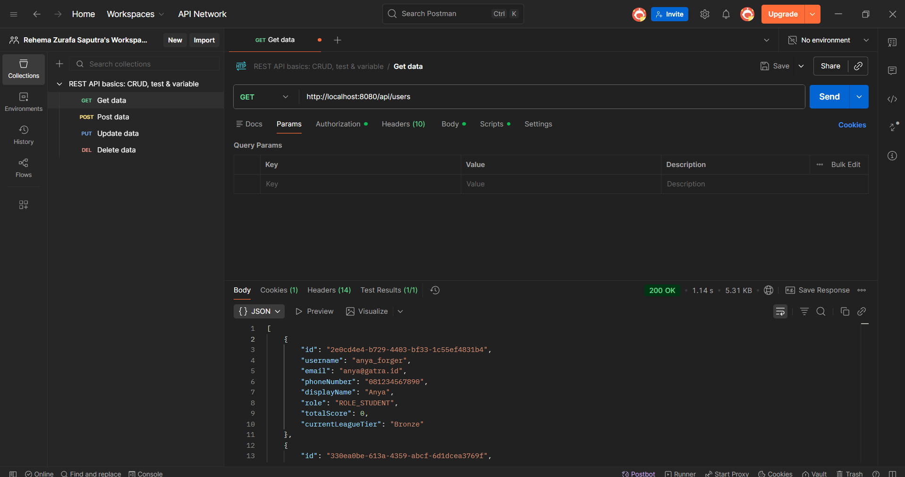

## Profiling getUsers

Before: 7.1 s

After: 1.14 s

### Catatan Optimasi: Perbaikan N+1 Query pada `UserService.getAllUsers()`

**Konteks Masalah (The N+1 Query Problem):**
Sebelum optimasi, method `getAllUsers()` mengambil seluruh entitas `User` (1 query utama). Namun, saat melakukan *mapping* data ke dalam bentuk `UserResponse`, sistem menjalankan dua query tambahan untuk setiap iterasi user individu:
1. `studentProfileRepository.findById(user.getId())`
2. `pointHistoryRepository.sumPointsByUserId(user.getId().toString())`

Ini berarti jika terdapat 1.000 user, sistem akan mengeksekusi **2.001 query SQL** (1 + 1000 + 1000). Kondisi ini menyebabkan beban database (*database overhead*) yang eksponensial seiring bertambahnya jumlah user.

**Pendekatan Solusi (Batch Fetching & In-Memory Stitching):**
Untuk memutus siklus pemanggilan database di dalam *looping*,mengimplementasikan pola pengambilan data secara *batch*:
1. Mengumpulkan semua `UUID` dari entitas `User` yang diambil pada query pertama.
2. Mengeksekusi dua *batch query* menggunakan klausa `IN` untuk mengambil seluruh `StudentProfile` dan total skor `PointHistory` dari semua user terkait sekaligus.
3. Mengonversi hasil data mentah (*batch result*) menjadi struktur data `Map` di Java (Memory).
4. Menyusun `UserResponse` dengan melakukan pencarian (*lookup*) ke dalam `Map` tersebut (O(1) *time complexity*), sehingga *mapping* berjalan sangat cepat tanpa interaksi database tambahan.

**Hasil Perbandingan (Profiling):**
- **Sebelum:** O(N) Query — Jumlah eksekusi query bergantung pada jumlah pengguna (contoh: puluhan hingga ribuan query).
- **Sesudah:** O(1) Relatif — Kompleksitas query konstan menjadi tepat **3 query SQL** untuk *request* sebesar apapun.
